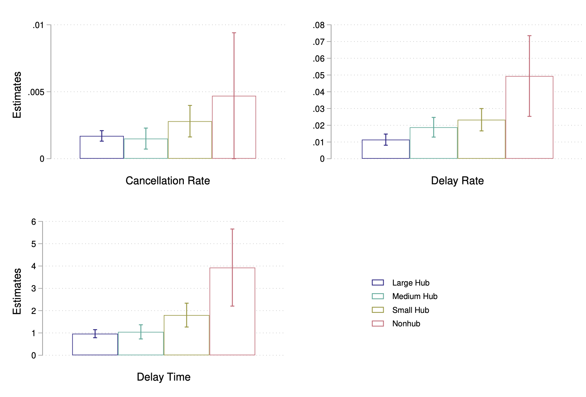

## Publication

---------------------------------------------------------------------------------------------

#### [Heat and Productivity: Evidence from Flight On-Time Performance](https://yuzhanhan.github.io/Research-Git/Papers/Heat_and_Productivity.pdf) 
with [Ying Shi](https://sites.google.com/site/yingandshi/home) 

*Accepted in the Journal of the Association of Environmental and Resource Economists*

*(<https://doi.org/10.1086/733369>)*

We investigate the impact of high temperatures on productivity using microdata from the U.S. airline industry. By linking high-frequency on-time flight performance measures with meteorological data, we show that higher temperatures significantly reduce airline productivity by increasing cancellation and delay rates and lengthening delay times. Using the American Time-Use Survey (ATUS), our complementary analyses suggest that the impact of higher temperatures operate in part through decreased labor supply (fewer hours worked and greater worker absenteeism) as well as reduced sleep quality and well-being, which may affect on-the-job productivity.

	
<u>Highlights</u>

	  <ul>
	    <li>We find that flights operating during days where temperatures are greater than 35 degrees Celsius are 30% more likely to be cancelled, 13% more likely to involve a late departure, and experience 21% longer delay time conditional on late departure.</li>
	    <li>An additional hour of heat exposure during the day is estimated to increase the departure delay rate and delay time later in the same day by 4% and 3%, respectively.</li>
	    <li>The heat's impacts are decreasing in airport size, with nonhub airports more negatively affected than large and medium hub airports.</li>
	    <li>We provide suggestive evidence on the mechanisms behind these estimates: a) Heat reduces hours worked (by 1.2-1.4 hours for transportation workers) and increases absenteeism; b) Heat exposure decreases workers’ sleep time and increases the probability of experiencing sleeplessness; c) The mechanism of sleep quality does not meaningfully influence workers’ labor supply. </li>
	  </ul>
	

	    <figure>
	      
	      <figcaption>Table: The Effect of Temperature on Flight On-Time Performance</figcaption>
	    </figure>
	    <figure>
	      
	      <figcaption>Figure: Heterogeneous Effects by Origin Airport Type</figcaption>
	    </figure>
  

	 

<!--  \#Environment \#Labor \#Heat \#Productivity  -->

---------------------------------------------------------------------------------------------

&nbsp;

## Working Paper

---------------------------------------------------------------------------------------------

#### [Air Pollution and Health at Work](https://yuzhanhan.github.io/Research-Git/Papers/FL_Air_Pollution_Work_Safety.pdf)

Despite pathophysiological evidence linking pollution to human physical and cognitive functioning, comparatively less is known about the economic consequences of such impacts. This paper investigates the causal effect of air pollution on worker health and workplace safety. Using a novel dataset combining high-frequency air pollution and meteorological data with workplace injury records from Florida and leveraging exogenous variations in pollution caused by temperature inversions, I find that PM2.5 significantly increases workplace injuries. The effect is nonlinear, increasing with rising pollution levels, and shows a non-negligible impact even at mild pollution levels below the current regulatory standards.

	
<u>Highlights</u>

	  <ul>
	    <li>The estimated effects of PM2.5 exhibit a non-linear pattern, with the impact increasing with rising pollution levels. A one-unit increase in PM2.5 at 12 micrograms per cubic meter is estimated to increase workplace injuries by 2%, while the effect is significantly greater for PM2.5 at 30 micrograms per cubic meter, to be approximately 21%.</li>
	    <li>I find no evidence of lagged or cumulative impacts, indicating that the estimated effects are primarily driven by acute exposure.</li>
	    <li>Supplementary analyses show that PM2.5 and ozone are more strongly associated with injuries resulting from cognitive-related issues, such as falls, slips, cuts, and being caught in machinery, rather than with injuries from other causes. </li>
	  </ul>
	

	    <figure>
	      
	      <figcaption>Figure: Marginal Effects of PM2.5</figcaption>
	    </figure>
	    <figure>
	      
	      <figcaption>Figure: Marginal Effects of PM2.5 and Ozone, w/ Lags and Leads</figcaption>
	    </figure>
  

<!--  \#Environment \#Labor \#AirPollution \#WorkSafety \#Bounds  -->

---------------------------------------------------------------------------------------------

#### [Monopsony in Academia and the Gender Pay Gap: Evidence from California](https://yuzhanhan.github.io/Research-Git/Papers/Monopsony_in_Academia.pdf) 
with [Alfonso Flores-Lagunes](https://aflores-lagunes.weebly.com)  

*Revision Requested in the Labour Economics*

We investigate monopsony power in a highly-skilled labor market given by tenure-ranked faculty in the University of California system, and analyze differential monopsony power exposure by gender. We infer the campus-level labor supply elasticity by estimating the elasticity of separations utilizing individual-level faculty data and two instruments based on campus revenues and salary scales. We find that the "exploitation rate," a common measure of monopsony power, is about 7% for tenure-ranked faculty. There is a statistically significant difference in the monopsony power experienced by male and female faculty, but it appears to account for a relatively small percentage of the observed gender pay gap. We provide some evidence that the gender difference in monopsony power experienced may be driven by academic fields with more options outside of academia.

<!-- #### Monopsony in Academia and the Gender Pay Gap: Evidence from California *(with [Alfonso Flores-Lagunes](https://aflores-lagunes.weebly.com))*   -->

	
<u>Highlights</u>

	<ul>
		<li>We find evidence that monopsony exists in the UC labor market for tenure-ranked faculty: the exploitation rate is robustly estimated at 7%.</li>
		<li>While we do not find statistically significant differences in the exposure to monopsony power across faculty groups, such as tenured/non-tenured and U.S./foreign born, we do find heterogeneity in the monopsony power across campuses, which could be related to their location.</li>
		<li>Male and female faculty members experience a statistically different level of monopsony power: on average, female faculty face a 1.3 pp (percentage point) higher exploitation rate relative to male faculty. This difference is driven by those faculty born in the U.S., among whom females experience a 2 pp higher level of monopsony power.</li>
		<li>The differential exposure to monopsony power would represent relatively little (8 to 12%) of the observed gender pay gap in the UC system. We conjecture that this is the result of the institutional setting we examine: campuses with salary transparency and public pay scales.</li>
	</ul>
	

	    <figure>
	      
	      <figcaption>Figure: Heterogeneous Monopsony Power Across Campuses</figcaption>
	    </figure>
  	

<!--  \#Monopsony \#GenderPayGap \#Academia \#LaborMarket    -->

---------------------------------------------------------------------------------------------

#### [Identifying Models With Mismeasured Endogenous Regressors Without Instruments: with an Application to Monopsony in Academic Labor Markets](https://yuzhanhan.github.io/Research-Git/Papers/noside_error_monopsony_LZ_ZY.pdf) 
with [Linqi Zhang](https://zhanglinqi.github.io)

<!--  \#RDD \#Selection \#Education  -->

	
<u>Abstract</u>

	We extend the linear triangular structural model of Lewbel, Schennach, and Zhang (2024) to account for measurement errors in the endogenous regressor. Using higher-order moments, we identify the causal effect and distributions of unobservables without relying on instrumental variables or repeated measurements. We apply this approach to study monopsony power in the labor market for university professors at public research universities within the University System of Georgia, addressing endogeneity and measurement error concerns related to faculty salaries in the absence of suitable instruments. Our findings reveal significant monopsony power, with a robust exploitation rate of 36%, and demonstrate that neglecting measurement error would lead to substantial underestimation.

---------------------------------------------------------------------------------------------

#### Carbon Footprint of Place-Based Economic Policies 
with [Sayahnika Basu](https://www.sayahnika.com) and [Yao Wang](https://www.yaowang.info) 

	
<u>Abstract</u>

	We assess the environmental impact of Special Economic Zones (SEZs), a place-based policy aimed at promoting economic development in India. Specifically, we examine the unintended effects of the policy on firms' energy consumption and carbon emissions. Using extensive firm-level data and a spatial RD-DiD design, we find that SEZs result in a significant 30% reduction in firms' carbon emissions, primarily driven by a shift from conventional energy to lower-carbon renewable alternatives. Heterogeneity analysis reveals that this substantial decline is largely driven by larger firms and those in regions with better access to cleaner energy.

<!--  \#Environment \#CarbonEmission \#EnergyConsumption \#SustainableDevelopment    -->

---------------------------------------------------------------------------------------------

<!-- #### [Does Air Pollution Impair Work Safety? The Impact of PM2.5 on Severe Workplace Injuries](https://yuzhanhan.github.io/Job-Market/Papers/JMP_ZhanhanYu.pdf) (Job Market Paper)   -->
#### Does Air Pollution Impair Work Safety? The Impact of PM2.5 on Severe Workplace Injuries 

	
<u>Abstract</u>

	I study the causal effect of air pollution on workplace safety in the U.S. using novel administrative data on severe workplace injuries. Air pollution, especially PM2.5, has been found to adversely impact human cognitive abilities and thus affect workplace safety via biological channels. Due to the endogeneity of air pollution, credibly pinning down its causal effect generally requires valid instruments. I test the validity of commonly-used IVs and provide statistical evidence that they are invalid for the workplace accident outcome. Leveraging partial identification methods that rely on weaker assumptions, I find evidence that air pollution increases workplace accidents. However, the estimated bounds suggest that the effect can be much smaller compared to what is typically found when adopting invalid IVs.

<!--  \#Environment \#Labor \#AirPollution \#WorkSafety \#Bounds  -->

---------------------------------------------------------------------------------------------

&nbsp;

## Selected Work in Progress

---------------------------------------------------------------------------------------------

#### The Effect of Tax Levies on Future Construction and Demolitions: The Importance of Zeros When Leveraging Voting Designs
with [David Brasington](https://business.uc.edu/faculty-and-research/departments/economics/faculty/david-brasington.html) and [Alfonso Flores-Lagunes](https://aflores-lagunes.weebly.com)

	
<u>Abstract</u>

	We investigate the effects of tax levies on future construction and demolitions. To estimate the effects, we leverage the voting that has taken place when a local government considers imposing the tax levies in a regression discontinuity design. Importantly we show that the results change dramatically based on whether one takes into account the incidence on zeros — localities where no construction or demolition took place — at the voting threshold. Furthermore, statistically accounting for these zeroes allows to disentangle two distinct effects that tax levies have: on the probability of observing non-zero construction or demolition, and on their conditional amount. Our results indicate that tax levies positively affect the amount of new construction. Estimates that do not account for the presence of zeros in the outcomes often have the opposite sign and are sometimes statistically significant.

<!--  \#RDD \#Selection  -->

---------------------------------------------------------------------------------------------

#### Revisiting the Texas Top 10% Policy: Application of Regression Discontinuity with Sample Selection
with [Alfonso Flores-Lagunes](https://aflores-lagunes.weebly.com), [Hugo Jales](https://sites.google.com/site/hugoborgesjales/home), and [Maria Zhu](http://www.mariazhu.com) 

<!--  \#RDD \#Selection \#Education  -->

<!-- [Back](./) -->
